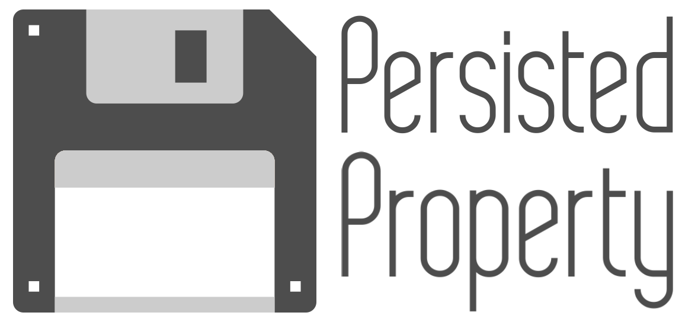

<p align="left">

</p>

[](https://swiftpackageindex.com/danielepantaleone/PersistedProperty)
[](https://swiftpackageindex.com/danielepantaleone/PersistedProperty)


A Swift-based lightweight framework that enable the persistence of Swift properties on a pre-configured storage.

## Table of contents

* [Feature Highlights](#feature-highlights)
* [Basic usage](#basic-usage)
* [Advanced usage](#advanced-usage)
* [Requirements](#requirements)
* [Installation](#installation)
    * [Cocoapods](#cocoapods)
    * [Swift Package Manager](#swift-package-manager)
* [Contributing](#contributing)
* [License](#license)

## Feature Highlights

- Compatible with **iOS 11+**
- Native support for `UserDefaults` based storage
- Native support for iOS `KeyChain` based storage
- Property persistence achieved through the `@Persisted` property wrapper
- Possibility to specify your custom storage facility

## Basic usage

Creating a persisted property it's just a matter of adding the `@Persisted` property wrapper on top of your variable, specifying the  key used to reflect the property value on the storage and assigning a default value to the property itself. If the property is `Optional` and no default value is provided, `nil` must be specified:

```swift
@Persisted(key: "myProperty")
var myProperty: Double = 10.0
@Persisted(key: "myOptionalProperty")
var myOptionalProperty: String? = nil // default value cannot be omitted
```

## Advanced usage

It's possible to customize on which storage service properties are going to be persisted. `PersistedProperty` provide native support for `UserDefaults` backed storage and `KeyChain` based storage. You can configure which storage to use when adding the `@Persisted` property wrapper on top of your property:

```swift
// This will be persisted in the standard UserDefaults (same as omitting the storage parameter).
@Persisted(key: "myProperty", storage: .standard)
var myProperty: Double = 10.0
// This will be persisted in the iOS KeyChain.
@Persisted(key: "myPassword", storage: .keychain)
var myPassword: String? = nil
```

Additionally, you can specify your custom storage service by creating your storage provider that conforms to the `StorageService` protocol:

```swift
/// A custom storage provider conforming to the StorageService protocol
class MyCustomStorageService: StorageService {
    
    func load<ValueType>(key: String) -> ValueType? where ValueType: Codable {
        // your code goes here
    }
    
    func save<ValueType>(_ value: ValueType, key: String) where ValueType: Codable {
        // your code goes here
    }
    
    func remove(key: String) {
        // your code goes here
    }
    
}

let myService: StorageService = MyCustomStorageService()

// This will be persisted in the custom storage service.
@Persisted(key: "myProperty", storage:  .custom(service: myService))
var myProperty: Double = 10.0
```

## Requirements

- iOS **11+**
- Xcode **14+** 
- Swift **5.7+**  

## Installation

### Cocoapods

Add the dependency to the `PersistedProperty` framework in your `Podfile`:

```ruby
pod 'PersistedProperty', '~> 1.0.0'
```

### Swift Package Manager

Add it as a dependency in a Swift Package:

```swift
dependencies: [
    .package(url: "https://github.com/danielepantaleone/PersistedProperty.git", .upToNextMajor(from: "1.0.0"))
]
```

## Contributing

If you like this project you can contribute it by:

- Submit a bug report by opening an [issue](https://github.com/danielepantaleone/PersistedProperty/issues)
- Submit code by opening a [pull request](https://github.com/danielepantaleone/PersistedProperty/pulls)

## License

```
MIT License

Copyright (c) 2023 Daniele Pantaleone

Permission is hereby granted, free of charge, to any person obtaining a copy
of this software and associated documentation files (the "Software"), to deal
in the Software without restriction, including without limitation the rights
to use, copy, modify, merge, publish, distribute, sublicense, and/or sell
copies of the Software, and to permit persons to whom the Software is
furnished to do so, subject to the following conditions:

The above copyright notice and this permission notice shall be included in all
copies or substantial portions of the Software.

THE SOFTWARE IS PROVIDED "AS IS", WITHOUT WARRANTY OF ANY KIND, EXPRESS OR
IMPLIED, INCLUDING BUT NOT LIMITED TO THE WARRANTIES OF MERCHANTABILITY,
FITNESS FOR A PARTICULAR PURPOSE AND NONINFRINGEMENT. IN NO EVENT SHALL THE
AUTHORS OR COPYRIGHT HOLDERS BE LIABLE FOR ANY CLAIM, DAMAGES OR OTHER
LIABILITY, WHETHER IN AN ACTION OF CONTRACT, TORT OR OTHERWISE, ARISING FROM,
OUT OF OR IN CONNECTION WITH THE SOFTWARE OR THE USE OR OTHER DEALINGS IN THE
SOFTWARE.
```
